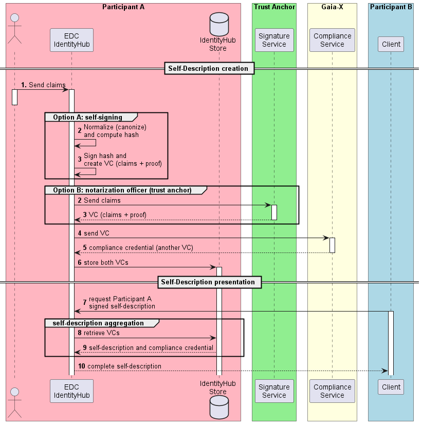

# Gaia-X Participant Self-Description

## Decision

Provide an extension for the [IdentityHub](https://github.com/eclipse-edc/IdentityHub) component enabling creation, signature and
exposure of Gaia-X participant self-description.

## Rationale

In a Gaia-X dataspace, participants must describe themselves using standardised, machine comprehensible metadata called self-description (SD; cf. [definition in the Gaia-X Glossary](https://gaia-x.gitlab.io/glossary/self_description/)).
According to the specification of the [Gaia-X credential format](https://gaia-x.gitlab.io/technical-committee/federation-services/icam/credential_format/), 
a SD is essentially a [W3C Verifiable Presentation (VP)](https://www.w3.org/TR/vc-data-model/), comprising one or more Verifiable Credentials (VC), each composed of a set of standardised claims describing the Gaia-X entity 
(e.g., in the case of a Participant, its name, LEI number, headquarter localisation, …). These VCs are signed by an authority endorsed by Gaia-X called a Trust Anchor (cf. the [Gaia-X Trust Framework](https://gaia-x.gitlab.io/policy-rules-committee/trust-framework/trust_anchors/))..  

## Approach

As described [here](https://gitlab.com/gaia-x/gaia-x-community/gaia-x-catalogue/catalogue-document/-/blob/85c23d34a6b1a37ab5982ec511493ce3ac8d54c6/01_self-descriptions.md), 
the signature process can either be performed directly by the participant using an identity (certificate) provided by a Trust Anchor, or by the Trust Anchor itself. Both flavours
should be supported by the extension.

After the Self-Description has been created, it is sent to the [Gaia-X Compliance service](https://compliance.gaia-x.eu/docs/#/Participant/ParticipantController_signContent) which validates 
the format of the VC claims and asserts that is has been signed by an endorsed Trust Anchor. If successful, the API returns a compliance credential, which is another VC containing a hash of the SD.

Both the SD and the compliance credential are then persisted into the store of the Identity Hub. 
Then, when a participant requests another participant SD, the SD and the associated compliance credential are 
retrieved from the store, assembled, and returned back to the caller.

## Diagram

As depicted below, the proposed extension will build the SD and verify it against the Gaia-X compliance API in one single step. 
Thus, the VP sent to the Gaia-X compliance service will contain a single VC whose claims are the one provided in input. 

