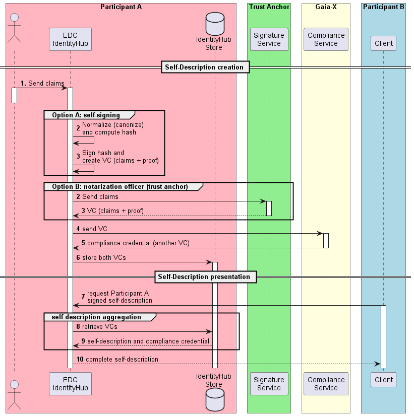

# Gaia-X Participant Self-Description

## Decision

Provide an extension for the [IdentityHub](https://github.com/eclipse-edc/IdentityHub) component enabling creation, signature and
exposure of Gaia-X participant self-description.

## Rationale

In a Gaia-X dataspace, each participant must describe themselves using standardised, machine comprehensible metadata called self-description (SD).
A SD is essentially a [W3C Verifiable Credential (VC)](https://www.w3.org/TR/vc-data-model/) composed of a set of standardised claims describing the participant (e.g. name, LEI number, headquarter localisation...) 
and signed by an authority endorsed by Gaia-X called a Trust Anchor.  

## Approach

As described [here](https://gitlab.com/gaia-x/gaia-x-community/gaia-x-catalogue/catalogue-document/-/blob/85c23d34a6b1a37ab5982ec511493ce3ac8d54c6/01_self-descriptions.md), 
the signature process can either be performed directly by the participant using an identity (certificate) provided by a Trust Anchor, or by the Trust Anchor itself. Both flavours
should be supported by the extension.

After the VC has been created, it is sent to the [Gaia-X Compliance service](https://compliance.gaia-x.eu/docs/#/Participant/ParticipantController_signContent) which validates 
the format of the VC claims and asserts that is has been signed by an endorsed Trust Anchor. If successful, the API returns a compliance credential, which is another VC containing a hash of the first one.

Both VCs are then persisted into a store. When a participant requests another to present its SD, these two VCs are assemble internally into a unique document returned to the caller.

## Diagram

